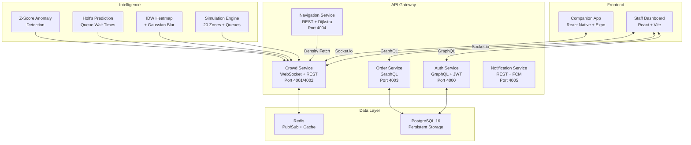

# CrowdFlow 🏟️
### **Real-Time Smart Stadium Intelligence & Crowd Management**

[](https://opensource.org/licenses/MIT)
[](https://nodejs.org)
[](https://cloud.google.com)
[](https://vitest.dev)
[](https://www.typescriptlang.org/)

**CrowdFlow** is a next-generation stadium companion platform designed to transform large-scale event management. By leveraging real-time data ingestion and high-performance visualizations, CrowdFlow helps stadium staff monitor crowd density, predict bottlenecks, and ensure the safety of thousands of attendees simultaneously.

---

## ⚡ Key Features

*   **📍 Live Heatmap Visualization**: High-fidelity IDW-interpolated heatmap with Gaussian blur tracking crowd movement with a 500ms broadcast interval.
*   **📊 Staff Intelligence Dashboard**: A centralized mission control for stadium operators providing real-time zone metrics, occupancy rates, and safety trends.
*   **🚨 Automated Safety Alerts**: Z-score anomaly detection that triggers staff notifications when zone density reaches critical thresholds (>85%).
*   **🍔 Integrated Concession Management**: Real-time queue monitoring, mobile ordering with GraphQL, and Holt's exponential smoothing for wait-time prediction.
*   **🚪 Smart Exit Planner**: Density-aware exit route optimization using Dijkstra's algorithm with real-time congestion multipliers and transport integration.
*   **⚡ Service Health Monitoring**: Live observability dashboard tracking health, latency, and uptime across all microservices.
*   **🚀 Cloud-Native Architecture**: Scalable microservices containerized with Docker, orchestrated via Docker Compose, with Terraform IaC for GCP.

---

## 🛠️ Modern Tech Stack

CrowdFlow is built as a highly performant **Turborepo monorepo**, ensuring code consistency and rapid deployment across the entire stack.

| Layer | Technology |
|---|---|
| **Core** | Node.js 22, TypeScript 5, Turborepo |
| **Frontend** | React 19, Vite 6, Vanilla CSS (Premium Custom Design) |
| **Backend** | Fastify 5, GraphQL (Mercurius), Prisma ORM |
| **Real-time** | Socket.io 4, Redis Pub/Sub |
| **Database** | PostgreSQL 16 (Relational), Redis (Transient State) |
| **Cloud/Infra** | Google Cloud (Compute Engine), Docker, Docker Compose, Terraform |
| **Testing** | Vitest, React Testing Library |
| **Analytics** | Google Analytics 4, Firebase Auth |
| **Security** | Argon2id hashing, JWT with refresh token rotation, Helmet, Rate Limiting |

---

## 📐 Architecture Overview



---

## 📁 Project Structure

```
crowdflow/
├── apps/
│   ├── staff-web/          # React staff dashboard (Vite + CSS)
│   └── companion-app/      # React Native mobile app (Expo)
├── services/
│   ├── auth-service/        # Authentication (GraphQL, Argon2id, JWT rotation)
│   ├── crowd-service/       # Real-time crowd engine (Socket.io, IDW heatmap)
│   ├── order-service/       # Concession management (GraphQL, Stripe-ready)
│   ├── navigation-service/  # Indoor pathfinding (Dijkstra's algorithm)
│   └── notification-service/ # Push notifications (Firebase Cloud Messaging)
├── packages/
│   ├── shared-types/        # Shared TypeScript types, enums, constants
│   └── config-typescript/   # Shared tsconfig base
├── deploy/
│   ├── k8s/                 # Kubernetes manifests (6 service deployments)
│   └── terraform/           # GCP infrastructure as code (GKE, Cloud SQL, Redis)
├── docs/
│   └── API.md               # Complete API documentation
├── .github/workflows/       # CI/CD pipeline (GitHub Actions → GCP)
├── docker-compose.yml       # Full-stack local/production orchestration
├── turbo.json               # Turborepo pipeline configuration
└── CONTRIBUTING.md           # Development guidelines
```

---

## 🚀 Quick Start

### **Local Development**
1.  **Clone & Install**:
    ```bash
    git clone https://github.com/abulaasvh/crowdflow.git
    cd crowdflow
    npm install
    ```
2.  **Environment Setup**:
    Copy `.env.example` to `.env` and configure your PostgreSQL and Redis credentials.
3.  **Run Services**:
    ```bash
    npm run dev
    ```

### **Cloud Deployment (GCP)**
CrowdFlow is optimized for Google Cloud. To deploy the current stack:
```bash
# Push to VM and run via Docker Compose
docker compose -f docker-compose.yml up --build -d
```

---

## 🧪 Testing

CrowdFlow uses **Vitest** for unit and integration testing across all services.

```bash
# Run all tests across the monorepo
npm run test

# Run tests for a specific service
cd services/auth-service && npm test
cd services/crowd-service && npm test
cd services/order-service && npm test
cd services/navigation-service && npm test
cd services/notification-service && npm test

# Type-check all code
npm run typecheck
```

### Test Coverage
| Service | Tests | Coverage Areas |
|---------|-------|----------------|
| Auth Service | 16 tests | JWT, validation, token rotation |
| Crowd Service | 12 tests | IDW heatmap, Gaussian blur, anomaly detection, prediction |
| Order Service | 15 tests | Menu data, order creation, status flow, schema |
| Navigation Service | 18 tests | Graph structure, Dijkstra's, density weighting |
| Notification Service | 14 tests | Schema validation, message construction, targets |
| Staff Dashboard | 4 tests | Login page rendering, accessibility |

---

## 📚 API Documentation

See the complete API reference: **[docs/API.md](docs/API.md)**

Covers all 5 microservices with request/response examples, WebSocket events, and authentication details.

---

## 🌟 Modern Safety First

CrowdFlow strictly adheres to safety and accessibility standards:
*   **WCAG 2.1 AA Compliance**: Keyboard-accessible maps and ARIA-enhanced status indicators.
*   **Smart Exit Planning**: Dijkstra-based routing via density-aware pathfinding during emergency evacuations.
*   **Security**: Argon2id hashing, JWT refresh token rotation with theft detection, Helmet security headers, and rate limiting.
*   **Error Resilience**: React Error Boundary with graceful fallback UI and retry functionality.

---

## 🔗 Live Demo
Experience the platform live: **[http://34.24.42.245](http://34.24.42.245)**

---

## 🤝 Contributing

We welcome contributions! Please see our [CONTRIBUTING.md](CONTRIBUTING.md) for development setup and guidelines.

---

## 📄 License
This project is licensed under the MIT License - see the [LICENSE](LICENSE) file for details.
