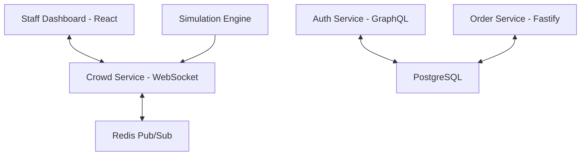

# CrowdFlow 🏟️
### **Real-Time Smart Stadium Intelligence & Crowd Management**

[](https://opensource.org/licenses/MIT)
[](https://nodejs.org)
[](https://cloud.google.com)

**CrowdFlow** is a next-generation stadium companion platform designed to transform large-scale event management. By leveraging real-time data ingestion and high-performance visualizations, CrowdFlow helps stadium staff monitor crowd density, predict bottlenecks, and ensure the safety of thousands of attendees simultaneously.

---

## ⚡ Key Features

*   **📍 Live Heatmap Visualization**: High-fidelity 3D-stylized heatmap tracking crowd movement with a 500ms broadcast interval.
*   **📊 Staff Intelligence Dashboard**: A centralized mission control for stadium operators providing real-time zone metrics, occupancy rates, and safety trends.
*   **🚨 Automated Safety Alerts**: Intelligent anomaly detection that triggers staff notifications when zone density reaches critical thresholds (>85%).
*   **🍔 Integrated Concession Management**: Real-time queue monitoring and mobile order synchronization to reduce congestion at food and beverage zones.
*   **🚀 Cloud-Native Architecture**: Scalable microservices containerized with Docker and deployed on Google Cloud Platform.

---

## 🛠️ Modern Tech Stack

CrowdFlow is built as a highly performant **Turborepo monorepo**, ensuring code consistency and rapid deployment across the entire stack.

| Layer | Technology |
|---|---|
| **Core** | Node.js 22, TypeScript 5, Turborepo |
| **Frontend** | React 19, Vite 6, Vanilla CSS (Premium Custom Design) |
| **Backend** | Fastify 5, GraphQL (Mercurius), Prisma ORM |
| **Real-time** | Socket.io 4, Redis Pub/Sub |
| **Database** | PostgreSQL 16 (Relational), Redis (Transient State) |
| **Cloud/Infra** | Google Cloud (Compute Engine), Docker, Docker Compose |
| **Analytics** | Google Analytics 4, Firebase Auth |

---

## 📐 Architecture Overview



---

## 🚀 Quick Start

### **Local Development**
1.  **Clone & Install**:
    ```bash
    npm install
    ```
2.  **Environment Setup**:
    Copy `.env.example` to `.env` and configure your PostgreSQL and Redis credentials.
3.  **Run Services**:
    ```bash
    npm run dev
    ```

### **Cloud Deployment (GCP)**
CrowdFlow is optimized for Google Cloud. To deploy the current stack:
```bash
# Push to VM and run via Docker Compose
docker compose -f docker-compose.yml up --build -d
```

---

## 🌟 Modern Safety First

CrowdFlow strictly adheres to safety and accessibility standards:
*   **WCAG 2.1 AA Compliance**: Keyboard-accessible maps and ARIA-enhanced status indicators.
*   **Smart Exit Planning**: Dynamic routing via Google Maps integration during emergency evacuations.
*   **Security**: Argon2id hashing and JWT-based Role-Based Access Control (RBAC).

---

## 🔗 Live Demo
Experience the platform live: **[http://34.24.42.245](http://34.24.42.245)**

---

## 📄 License
This project is licensed under the MIT License - see the [LICENSE](LICENSE) file for details.
